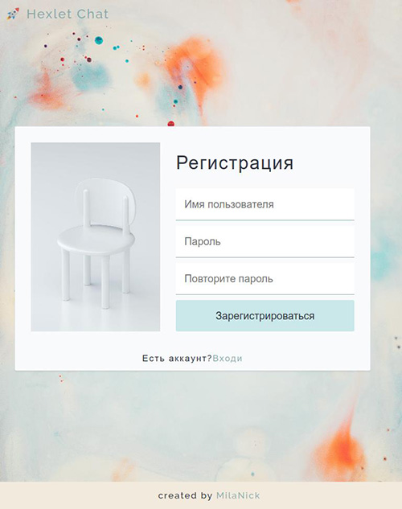
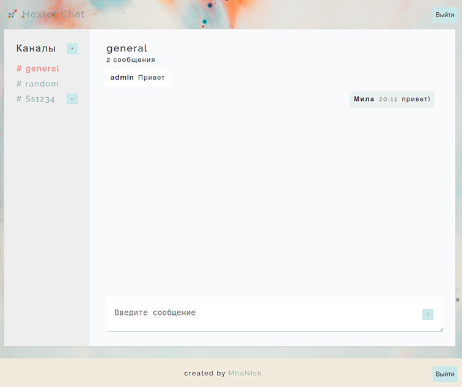

### Hexlet tests and linter status:

## 💬 Chat [here](https://milachat.herokuapp.com/)  

<<<<<<< HEAD

    

### Overview
Chat is a simple real-time chat application.  

### Features
Registration and authorization. The project has a small server that supports JWT technology.
Create, rename and delete channels. These operations take place inside models.
Create and receive messages. Implemented via websockets.
All forms validation and error handling. Used by formik.

### Tech Stack
React with hooks, Redux Toolkit, socket.io, formik, i18next
ESLint, Webpack v5, Heroku, Rollbar

### By default available one user: 
admin / admin